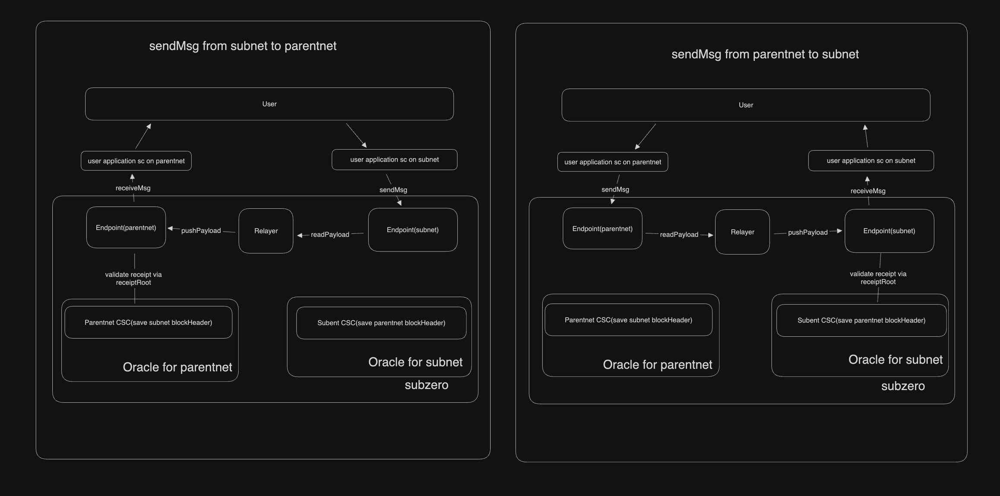

# XDC ZERO: Advanced Cross-Chain System 

Achieve unparalleled blockchain interoperability with XDC ZERO, ensuring frictionless data transmission and rigorous validation across a multitude of chains.

## Table of Contents

- [Oracle](https://github.com/XinFinOrg/XDC-CSC)
- [Endpoint](/endpoint/)
- [Relayer](/relayer/)
- [Frontend](/frontend/)

## Key Components

### Oracle

Acting as the architectural keystone, the Oracle ensures the safe transfer of pivotal data, notably block headers, bridging source and target blockchains. Utilizing CSC contracts, the system guarantees not just steadfast data transfer but also the safeguarding of crucial block header details on the destination blockchain. Such functionalities affirm the data's integrity and coherence throughout chains.

### Relayer

The Relayer functions as the essential conduit for transactional precision. Its core duty is to extract payload data from the source chain's Endpoint contract and channel it to the counterpart on the target chain. With this mechanism in place, XDC ZERO promises the exact and secure relay of transaction data, fostering efficient cross-chain synergies.

### Endpoint

The XDC Zero Endpoint stands as the nexus for cross-chain communication, adeptly receiving and dispatching data packets across disparate blockchain networks. It offers indispensable services for the fluid operation of the cross-chain paradigm:

- **Data Reception & Dispatch**: The Endpoint ensures data packets, once received from a chain, are aptly relayed to another, directing data unerringly to its designated recipient.
  
- **Chain Integration**: The Endpoint facilitates the seamless onboarding of new blockchains into the system. By denoting unique identifiers and related contracts, it amalgamates new chains into the existing cross-chain communication matrix.
  
- **Transaction Authentication**: With the Endpoint's prowess, transactions undergo rigorous validation, certifying their authenticity before processing, thus bolstering system security against potential threats.
  
- **Payload Access**: The Endpoint offers a user-friendly interface for applications and entities to pull cross-chain payload data, an essential feature for apps dependent on inter-chain data streams.

At its core, the Endpoint functions as the orchestrator for all cross-chain data activities, ensuring data is meticulously received, processed, and channeled to its rightful destination.

### Frontend

Experience a user-centric interface to manage the endpoint contracts spanning different chains. View the chain entities already synchronized with the current endpoint contract and effortlessly onboard new chain entities as per requirements.

