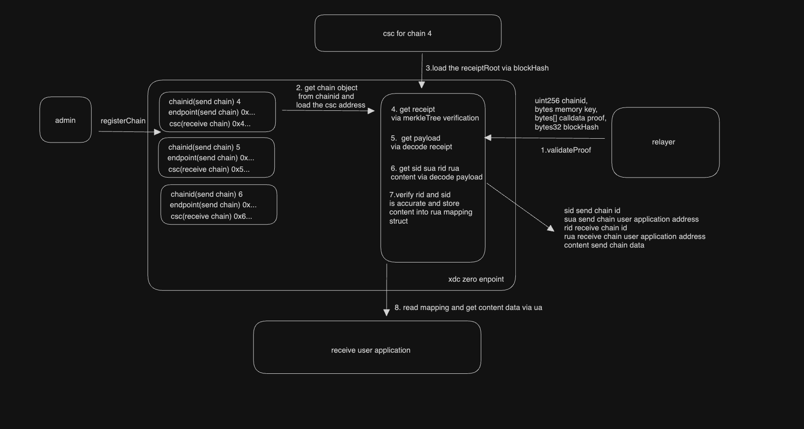

# XDC Zero Endpoint

The XDC Zero Endpoint is a foundational cross-chain contract that enables seamless reception and dispatch of data packets across diverse blockchain networks.

## Table of Contents

- [Overview](#overview)
- [Contract Development and Deployment](#contract-development-and-deployment)
- [Additional Commands](#additional-commands)

## Overview

- **Initialization**: Set the `chainId` for the current blockchain.
- **Register Chain**: Introduce a new blockchain, providing its unique identifier, checkpoint contract, and endpoint contract.
- **Send Packet**: Dispatch a data packet to a specified receiving chain.
- **Validate Transaction Proof**:
  - Monitor payload event data via a relayer from the sending chain's Zero Endpoint contract.
  - Deduce the `rid` (receiver's chainId).
  - Execute the `validateTransactionProof` method on the recipient chain, authenticating and archiving the transaction payload.
- **Retrieve Payload**: Applications, identified by `ra`, can easily access the cross-chain payload from the Zero Endpoint contract.

## Workflow


## Contract Development and Deployment

### Environment Setup

1. **Install Dependencies**:
   ```shell
   yarn
   ```
2. **Compile & Test**:
   ```shell
   npx hardhat test
   ```

### Contract Configuration

1. **Configuration Files**:

   - Update `deployment.config.json` with the current endpoint's `chainId`.
   - Specify network details in `network.config.json`:
     - `xdcparentnet`: RPC URL.
     - `xdcsubnet`: RPC URL.

2. **Environment Variables**:
   - Set up a `.env` file based on `.env.sample` and provide a valid private key.

### Deployment

1. **Deploy XDC Zero**:
   ```shell
   npx hardhat run scripts/xdcZeroDeploy.js --network xdcparentnet
   ```

## Additional Commands

For comprehensive functionalities or deeper insights, refer to the command list below:

```shell
npx hardhat accounts
npx hardhat compile
npx hardhat clean
npx hardhat test
npx hardhat node
npx hardhat help
REPORT_GAS=true npx hardhat test
npx prettier '**/*.{js,json,sol,md}' --check
npx prettier '**/*.{js,json,sol,md}' --write
npx solhint 'contracts/**/*.sol'
npx solhint 'contracts/**/*.sol' --fix
```
